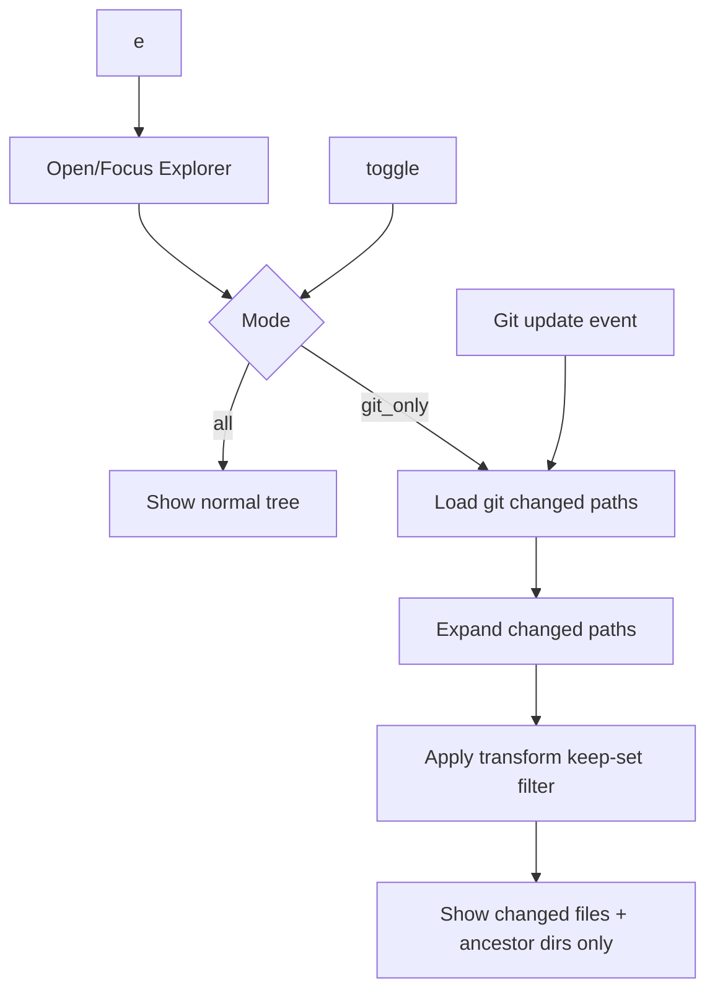

# snacks-sidebar

## Overview

`snacks-sidebar` customizes the `snacks.nvim` explorer with two sidebar modes:

- `all`: default file tree behavior (show everything based on explorer options)
- `git_only`: show only paths from Git status (changed, staged, untracked) plus ancestor directories needed to keep the tree navigable

The module also provides:

- `<leader>e` to open/focus/close the explorer sidebar
- `<a-g>` inside explorer list to toggle between `all` and `git_only`
- persisted mode via `vim.g.snacks_sidebar_mode`
- live refresh in `git_only` mode using `snacks.explorer.git.update`

## High-Level Flow

1. User presses `<leader>e`.
2. Module opens explorer using current mode (`vim.g.snacks_sidebar_mode`, default `all`).
3. User presses `<a-g>` in explorer to toggle mode.
4. If toggled to `git_only`:
   - Collect changed paths from `git status --porcelain=v1 -z -uall`.
   - Save them to `picker.opts.git_only_changed_paths`.
   - Expand tree nodes so changed files are visible.
   - Register git update callback to keep the list in sync.
5. Explorer `transform` filter runs:
   - In `all`: return every item.
   - In `git_only`: build keep-set (changed files + parent dirs + cwd root), hide everything else.
6. If toggled back to `all`, clear git-only state and refresh picker view.

